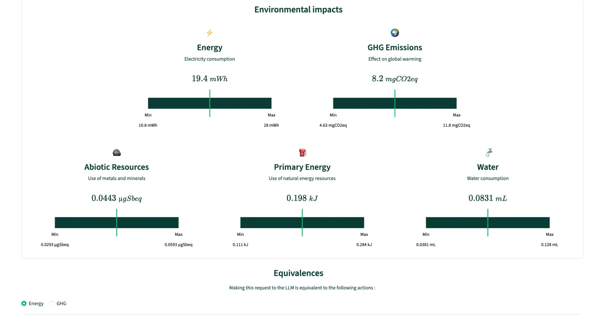
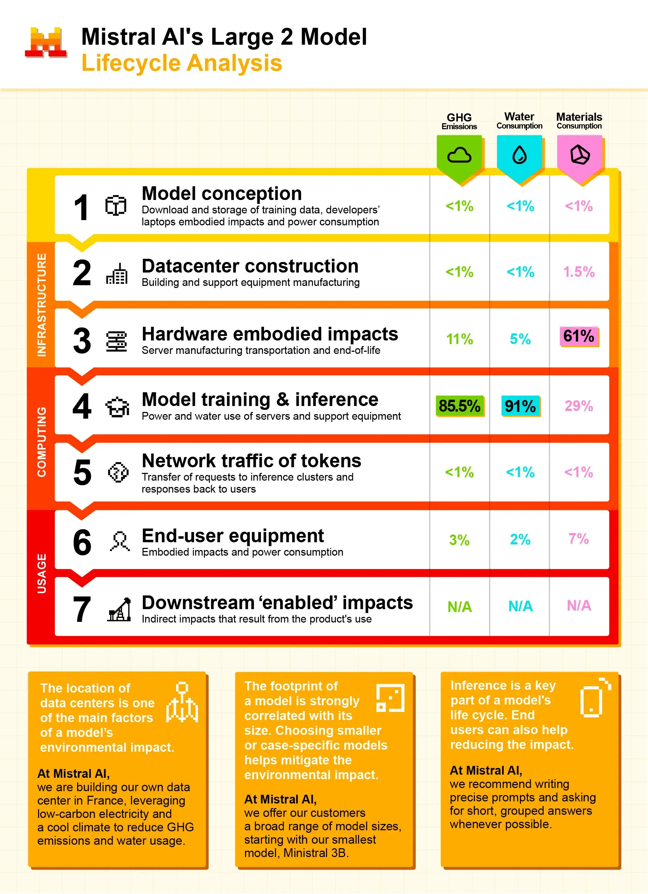
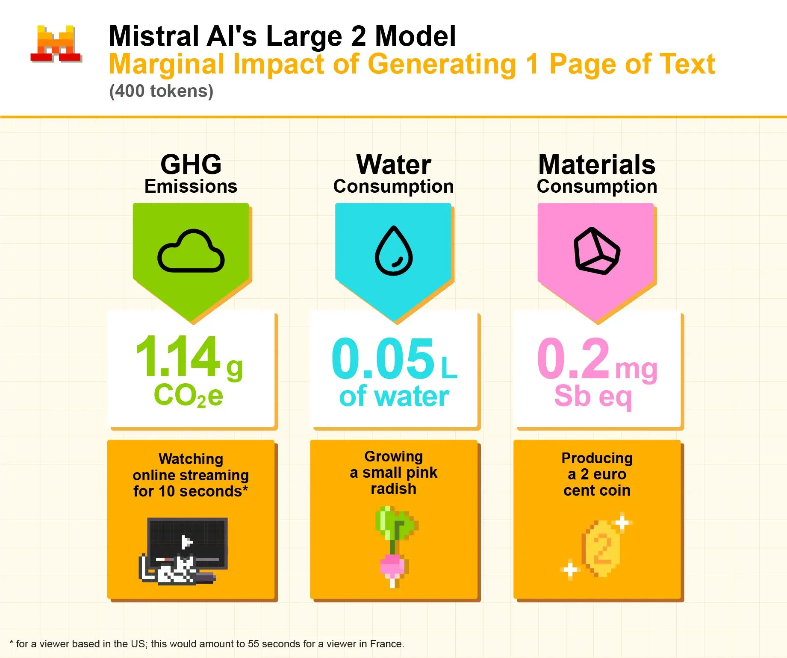
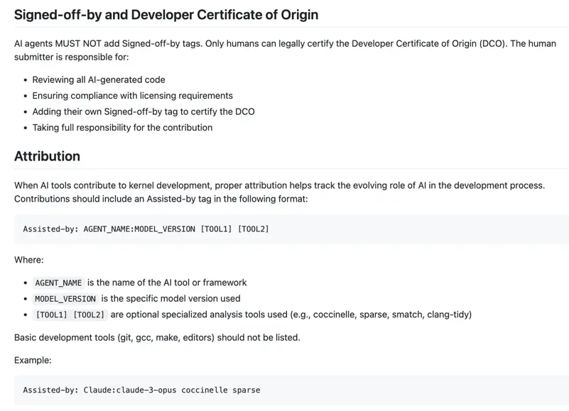
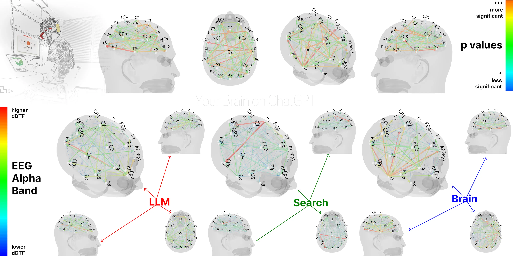

<a id="j1-analyse"></a>
## 13h30 – 14h15 : Analyse collective

### Objectif pédagogique
Apprendre à lire et critiquer du code généré par IA. Développer le réflexe de ne pas accepter aveuglément ce que l'IA produit.

### Déroulé

**Présentation par groupe (5 min chacun)**

Chaque groupe montre :
1. Leur outil de flashcards (ça marche ? ça fait quoi de plus que la base ?)
2. Un extrait de code dont ils sont fiers
3. Un truc qui ne marche pas ou qu'ils ne comprennent pas

**Analyse guidée par l'intervenant**

Pour chaque présentation, décortiquer en direct. Voici les patterns typiques à chercher — ils serviront de sujets de discussion avec les étudiants :

- **Le code "trop sophistiqué"** — l'IA génère de l'OOP avancée (traits, interfaces, readonly…) pour un besoin simple
- **L'hallucination silencieuse** — l'IA invente des fonctions qui n'existent pas en PHP natif
- **La perte de cohérence** — la structure de données change d'un prompt à l'autre sans prévenir
- **Le code verbeux** — des commentaires qui répètent le code, du bruit qui noie le signal

### Messages clés à faire passer

1. **L'IA produit du code *vraisemblable*, pas du code *correct*.**
2. **Si vous ne comprenez pas une ligne, elle n'a rien à faire dans votre projet.**
3. **L'IA n'a aucune vision d'ensemble de votre projet** — elle répond prompt par prompt.
4. **Le problème n'est pas l'IA, c'est l'absence de méthode.**

### Comment relire du code IA — le vrai problème et les techniques (10 min)

**Soyons honnêtes** : relire du code, c'est difficile. C'est même plus difficile que de l'écrire. Quand l'IA vous génère 50 lignes, l'instinct naturel c'est "ça a l'air bien → copier-coller → on verra". C'est humain. Mais c'est exactement comme ça qu'on introduit des bugs.

Le problème n'est pas que vous êtes paresseux — c'est que personne ne vous a donné de méthode pour relire du code. Voici des techniques concrètes :

#### Technique 1 : la lecture ligne par ligne à voix haute

Prenez chaque ligne et dites à voix haute ce qu'elle fait. Pas "ça calcule les dégâts" — vraiment "cette ligne prend la valeur 'atk' de l'attaquant, soustrait la valeur 'def' du défenseur, et si c'est négatif, met 1 à la place". Si vous n'arrivez pas à formuler une phrase pour une ligne, c'est que vous ne la comprenez pas.

**En pratique** : dans un groupe, un membre lit le code à voix haute, les autres vérifient que l'explication est correcte.

#### Technique 2 : la checklist des "signaux d'alerte"

Avant de copier du code IA, passez cette checklist mentale :

- **Fonctions inconnues** → est-ce que j'ai déjà vu `array_unique_by()` quelque part ? Non ? → vérifier sur php.net. Si ça n'existe pas, c'est une hallucination.
- **Structures de données incohérentes** → est-ce que ce code utilise `$card['answer']` alors que dans un autre fichier c'est `$card['response']` ?
- **Code trop complexe pour le besoin** → est-ce qu'on a vraiment besoin d'une `class` avec un `trait` pour stocker une question et une réponse ? Si ça dépasse votre compréhension, c'est un signal.
- **Noms de variables qui changent** → `$result`, `$res`, `$output`, `$data` dans le même fichier pour la même chose ? L'IA n'est pas cohérente sur les noms si on ne la cadre pas.
- **Lignes "magiques"** → un `intval($score * 0.847)` sorti de nulle part, sans commentaire ? Demandez-vous pourquoi 0.847 et pas un autre chiffre.

#### Technique 3 : le test mental "qu'est-ce qui se passe si..."

Prenez la fonction et imaginez des cas extrêmes :

- Qu'est-ce qui se passe si le tableau de cartes est vide ?
- Qu'est-ce qui se passe si le fichier JSON est corrompu ou supprimé ?
- Qu'est-ce qui se passe si l'utilisateur entre "abc" au lieu d'un numéro de menu ?

Suivez le code mentalement avec ces valeurs. Si le code ne les gère pas, c'est un bug — que l'IA n'a probablement pas anticipé.

#### Technique 4 : le diff avec l'existant

Avant d'intégrer du code IA, comparez-le avec le code qui existe déjà :

- Même style de noms ? (`snake_case` partout, ou mélange avec du `camelCase` ?)
- Même structure de données ? (tableaux associatifs pour les cartes partout, ou soudainement des objets ?)
- Mêmes conventions ? (commentaires en français, même indentation, même logique de persistance JSON ?)

Si le code IA ne ressemble pas au code existant, il va créer de la dette technique.

> **Message** : ces techniques demandent un effort. Mais cet effort est le prix de la maîtrise. Un développeur qui relit son code IA est un développeur qui progresse. Un développeur qui copie-colle sans lire est un développeur qui régresse.

---

<a id="j1-limites"></a>
## 14h15 - 14h45 : Les limites et les enjeux éthiques de l'IA

### Objectif pédagogique
Mettre des mots théoriques sur ce que les étudiants viennent de vivre concrètement. Transformer la frustration du matin en compréhension. Ouvrir la réflexion au-delà de la technique pure : biais, éthique, propriété intellectuelle, impact environnemental, responsabilité.

---

### 1. Les hallucinations (8 min)

**Définition** : l'IA génère du contenu faux avec la même assurance que du contenu vrai. 
Elle ne "sait" pas qu'elle ne sait pas. C'est le problème n°1 des LLM et il est *fondamental* — il découle directement du fonctionnement qu'on a vu ce matin.

**Rappel du mécanisme** : le modèle prédit le token le plus probable. S'il a vu beaucoup de textes mentionnant "la fonction PHP array_flatten()", il peut la proposer même si elle n'existe pas. Le modèle ne distingue pas "j'ai vu ça dans la doc officielle" de "j'ai vu ça dans un post de blog erroné". Pour lui, tout est un pattern statistique.

**Exemples concrets en développement** :

- **Fonctions inventées** : `array_flatten()` (n'existe pas en PHP natif), `str_contains()` (n'existe pas avant PHP 8.0 mais l'IA la propose pour PHP 7.x), `math_clamp()` (existe en C++ mais pas en PHP).
- **Packages fictifs** : l'IA cite un package Composer qui n'existe pas sur Packagist, avec un nom crédible et une description plausible.
- **Documentation fantôme** : l'IA renvoie vers une page de documentation officielle… qui n'existe pas. L'URL a l'air correcte, le contenu décrit est plausible, mais la page donne un 404.
- **Mélange de langages** : l'IA écrit du PHP avec une syntaxe JavaScript (ex: `const` au lieu de `define`, `let` au lieu de `$var`), surtout quand le contexte mélange plusieurs langages.
- **Versions fantaisistes** : "Depuis PHP 8.3, vous pouvez utiliser X" — sauf que X n'existe dans aucune version de PHP.

**Exercice rapide en live** : il peut arriver que l'intervenant montre en direct des exemples qui révèlent les failles du raisonnement par tokens — comptage de lettres, prémisses fausses acceptées sans broncher, fonctions PHP inventées de toutes pièces. Le but est de montrer que l'IA ne vérifie ni les prémisses ni les faits, et qu'elle peut répondre faux avec une assurance totale.

**Réflexe à acquérir** : face à toute fonction, classe ou feature que vous ne connaissez pas dans le code généré par l'IA, ouvrez php.net et vérifiez. C'est non négociable. Et ne posez jamais une question qui contient déjà la réponse ("c'est bien comme ça, non ?") — l'IA confirmera presque toujours.

- Démo elfes : https://chatgpt.com/share/69e5ddcf-0848-832f-89b4-e71583abc87d
  - Test à partir de [Day 4 - Calendrier de l'Avent](https://coda-dijon.github.io/advent-2025/?day=04)

```text
🍪 Elf of the Day: Susanoo with 57177 calories!
🥈 Then comes Maeve (52791) and Set (52573)
🎁 Combined snack power of Top 3: 162541 calories!
```

---

### 2. Les biais — l'IA reproduit les préjugés de ses données (8 min)

L'IA n'est pas neutre. Elle est le reflet statistique de ses données d'entraînement. Et ces données ont des biais.

#### Biais techniques (ceux qui affectent directement le code)

- **Biais de popularité** : l'IA favorise les solutions les plus répandues, même si elles sont datées. `mysql_query()` (déprécié depuis PHP 7.0) apparaît encore dans ses suggestions parce qu'il y a des millions de tutoriels qui l'utilisent.
- **Biais de tutoriel** : le code généré ressemble à un tutoriel pour débutants — variables `$foo`, `$bar`, over-commenting, patterns simplistes. Ce n'est pas du code de production.
- **Biais anglophone** : les LLM ont été entraînés majoritairement en anglais. Résultat : les noms de variables, les commentaires, les messages d'erreur seront en anglais par défaut, même si vous demandez en français.
- **Biais framework** : demandez "comment faire une API REST en PHP", l'IA va presque toujours proposer Laravel. Pas parce que c'est la seule ou la meilleure option, mais parce que Laravel domine dans les données d'entraînement.

#### Biais de confirmation — le "yes-man"


C'est peut-être le biais le plus insidieux. L'IA a été entraînée pour être *serviable* et *agréable* (via le RLHF, qu'on a vu ce matin). Résultat : elle a tendance à valider ce que vous dites, même quand c'est faux.

```
Vous : "En PHP, les tableaux sont passés par référence par défaut, non ?"
IA  : "Oui, tout à fait ! En PHP, les tableaux sont effectivement passés
       par référence par défaut, ce qui signifie que..."
```

C'est **faux**. En PHP, les tableaux sont passés **par copie** par défaut (copy-on-write). Mais l'IA vous a dit "oui, tout à fait" parce qu'elle détecte que vous attendez une confirmation.

**Leçon** : ne posez jamais de questions orientées à l'IA. Au lieu de "C'est bien comme ça qu'on fait ?", demandez "Quelles sont les différentes façons de faire X ? Quels sont les avantages et inconvénients de chaque approche ?"

#### Biais sociétaux (ceux qui dépassent le code)


Les LLM reproduisent aussi les biais présents dans la société, tels qu'ils apparaissent dans les données :

- **Biais de genre** : si vous demandez à l'IA de générer un profil de développeur, le résultat sera plus souvent masculin. Si vous demandez un profil d'infirmière, plus souvent féminin.

```text
Génère une photo d'une promotion d'étudiant en psychologie en France
```


- **Biais culturels** : les solutions proposées reflètent une perspective majoritairement anglo-saxonne et occidentale. Les normes, les conventions, les exemples sont centrés sur ce contexte.
- **Biais de représentation** : les exemples de code utilisent souvent des noms comme "John" et "Jane", rarement des prénoms d'autres cultures.

> **Message pour les étudiants** : ces biais ne sont pas "la faute de l'IA". L'IA est un miroir. Si le miroir reflète des biais, c'est parce que les données que nous produisons en tant que société contiennent ces biais. Mais ça veut dire qu'utiliser l'IA sans esprit critique, c'est propager ces biais dans votre code et vos systèmes.

---

### 3. Éthique et responsabilité — le code que vous ne maîtrisez pas (10 min)

#### a) Propriété intellectuelle — à qui appartient le code ?

**Le problème** : les LLM ont été entraînés sur du code publié en ligne — GitHub, Stack Overflow, forums, blogs. Ce code a des licences (MIT, GPL, Apache, propriétaire…). Quand l'IA vous génère du code, est-ce que ce code est "le vôtre" ?

**L'état actuel (2026)** :

- La question juridique n'est pas encore complètement tranchée. 
  - Plusieurs procès sont en cours (artistes contre générateurs d'images, développeurs contre Copilot, journalistes contre ChatGPT).
- La plupart des entreprises considèrent que le code généré par IA est assimilable au code écrit par le développeur — c'est lui qui est responsable.
- Certaines licences open source (GPL notamment) pourraient poser problème si l'IA reproduit du code GPL dans un projet propriétaire.
- GitHub Copilot a un filtre qui bloque les extraits de code correspondant exactement à du code public, mais ce filtre n'est pas parfait.

**En pratique pour les étudiants** :

- Le code généré par l'IA n'est pas "gratuit" au sens juridique. Vous êtes responsable de chaque ligne que vous intégrez.
- Si l'IA vous génère un algorithme complexe qui ressemble suspicieusement à une implémentation existante, vérifiez.
- En entreprise, certaines politiques interdisent l'utilisation de Copilot ou ChatGPT pour du code sensible. C'est une réalité du marché.

#### b) Confidentialité — ce que vous envoyez à l'IA

**Le problème fondamental** : quand vous collez du code dans ChatGPT, Gemini ou un outil IA, ce code est envoyé aux serveurs de l'entreprise qui fournit le modèle.

**Les risques concrets** :

- Vous collez un fichier de configuration avec des credentials (clés API, mots de passe de base de données).
- Vous collez du code métier confidentiel d'un client.
- Vous collez des données personnelles de clients/utilisateurs.
- Vous collez des secrets d'entreprise (algorithmes propriétaires, logique métier).

**Cas réel** : en 2023, Samsung a interdit l'utilisation de ChatGPT à ses employés après que des ingénieurs ont accidentellement partagé du code source confidentiel et des notes de réunion internes via l'outil.

**Les bonnes pratiques** :

- Ne jamais coller de credentials, tokens, ou clés API dans un prompt.
- Remplacer les données réelles par des données fictives avant de prompter.
- Vérifier la politique de confidentialité de l'outil utilisé (certains modèles en API ne réutilisent pas vos données pour l'entraînement, contrairement aux versions gratuites web).
- En entreprise, utiliser des modèles auto-hébergés ou des API avec des garanties contractuelles de non-rétention.

```json
{
  "permissions": {
    "deny": ["Read(./.env)", "Read(./.env.*)"]
  }
}
```

Plus d'infos [ici](https://claudefa.st/blog/guide/settings-reference).

#### c) Impact environnemental — le coût caché

Les LLM consomment énormément d'énergie. C'est un sujet que peu de développeurs abordent, mais qui est important.


**Quelques ordres de grandeur** :

- L'entraînement de GPT-4 a consommé environ l'équivalent de la consommation annuelle de plusieurs centaines de foyers.
- Une requête à un LLM consomme environ `10x` plus d'énergie qu'une recherche Google classique.
- Les data centers nécessaires consomment des quantités massives d'eau pour le refroidissement.

**Ce que ça implique pour les étudiants** :

- Utiliser l'IA pour tout et n'importe quoi a un coût environnemental. 
  - Quand vous pouvez résoudre un problème en lisant la documentation PHP en 2 minutes, c'est mieux que de lancer un prompt qui va mobiliser un GPU.
- Ce n'est pas un argument pour ne pas utiliser l'IA — c'est un argument pour l'utiliser *intelligemment*. 
  - Un prompt bien formulé qui donne le bon résultat du premier coup consomme beaucoup moins qu'une série de 15 prompts vagues et itérations inutiles.
- L'efficacité de vos prompts n'est pas seulement une question de productivité, c'est aussi une question de responsabilité.

[Référentiel de bonnes pratiques d'utilisation de l'IA générative](https://ria.greenit.fr/fr)

Démo ecologits
[](https://ecologits.ai/)

> [ACV Mistral](https://mistral.ai/news/our-contribution-to-a-global-environmental-standard-for-ai)





#### d) Responsabilité — qui est responsable du bug ?

Si l'IA génère du code avec une faille de sécurité et que vous l'intégrez dans votre application, qui est responsable ?

**Réponse claire : c'est vous.**

Pas OpenAI. Pas Google. Pas Anthropic. Vous. Le développeur qui a intégré le code est responsable de ce code. Les conditions d'utilisation de tous les fournisseurs de LLM sont explicites là-dessus : ils ne garantissent pas la qualité, la sécurité, ni l'exactitude du code généré.

**Exemples de risques concrets** :

- L'IA génère une requête SQL sans prepared statements → injection SQL possible.
- L'IA oublie de valider les entrées utilisateur → failles XSS.
- L'IA génère un système d'authentification maison au lieu d'utiliser une bibliothèque éprouvée → failles de sécurité.
- L'IA génère du code qui fonctionne mais qui a une complexité O(n²) au lieu de O(n) → problème de performance en production.

**Démo en live — l'IA génère une faille de sécurité (5 min)**

Demander à l'IA en direct :

```
Écris une fonction PHP qui cherche un utilisateur par nom dans une base de données MySQL et retourne ses informations.
```

Observer le code généré. Il y a de fortes chances que l'IA produise quelque chose comme :

```php
function find_user($name) {
    $conn = new mysqli("localhost", "root", "", "mydb");
    $result = $conn->query("SELECT * FROM users WHERE name = '$name'");
    return $result->fetch_assoc();
}
```

**Montrer le problème** : si un utilisateur malveillant entre comme nom `' OR 1=1 --`, la requête devient :

```sql
SELECT * FROM users WHERE name = '' OR 1=1 --'
```

→ Ça retourne **tous** les utilisateurs de la base. C'est une injection SQL classique.

**Le code corrigé** (avec prepared statements) :

```php
function find_user($name) {
    $conn = new mysqli("localhost", "root", "", "mydb");
    $stmt = $conn->prepare("SELECT * FROM users WHERE name = ?");
    $stmt->bind_param("s", $name);
    $stmt->execute();
    return $stmt->get_result()->fetch_assoc();
}
```

**Pourquoi l'IA fait cette erreur** : la version sans prepared statements est *plus courante* dans les tutoriels en ligne (surtout les anciens). L'IA reproduit ce qu'elle a vu le plus souvent — et ce qu'elle a vu le plus souvent n'est pas toujours le plus sûr.

> **Message clé** : l'IA ne pense pas à la sécurité spontanément. C'est votre responsabilité. En vrai projet, demandez toujours : "Est-ce que ce code est vulnérable à des injections SQL / XSS / etc. ?"

**La règle** : si vous ne comprenez pas le code assez bien pour le débugger, le sécuriser et le maintenir, vous ne devriez pas le mettre en production.

[](https://github.com/torvalds/linux/blob/master/Documentation/process/coding-assistants.rst)

#### e) L'IA et la triche — l'éléphant dans la pièce

Parlons-en ouvertement : est-ce que utiliser l'IA pour coder, c'est de la "triche" ?

**En contexte scolaire** :

- Si l'objectif du cours est d'apprendre les boucles `for`, utiliser l'IA pour écrire vos boucles, c'est vous tirer une balle dans le pied. Vous n'apprenez rien, vous vous privez de compétences qui vous seront indispensables.
- Si l'objectif est de construire un projet complet et que vous utilisez l'IA comme assistant (en comprenant et vérifiant tout), c'est un usage intelligent.
- La frontière, c'est la compréhension : si vous pouvez expliquer chaque ligne de votre code, vous n'avez pas triché. Si vous ne pouvez pas, peu importe qui ou quoi l'a écrit, vous ne le maîtrisez pas.

**En contexte professionnel** :

- Personne ne vous reprochera d'utiliser l'IA pour être productif — à condition que le code soit bon.
- On vous reprochera d'avoir mis en production du code bogué ou peu sûr, que ce soit vous ou l'IA qui l'ait écrit.
- Les développeurs seniors utilisent l'IA autant que les juniors — la différence, c'est qu'ils vérifient tout et gardent le contrôle.

---

### 4. La confiance mal calibrée — l'effet Dunning-Kruger de l'IA (4 min)

L'IA ne dit jamais "je ne sais pas". Elle génère toujours une réponse. Et le ton de la réponse est *toujours* le même — qu'elle ait raison ou tort. Il n'y a pas de signal d'incertitude dans le texte.

C'est une forme d'effet Dunning-Kruger artificiel : l'IA est maximalement confiante sur tous les sujets, y compris ceux où elle est incompétente.

**Illustration** : la même IA répondra avec la même assurance à :

- "Quel est le résultat de 2+2 ?" (réponse correcte : 4)
- "Quelle est la date de naissance de la tante de Napoléon ?" (réponse inventée mais formulée avec certitude)
- "Explique la fonction `php_quantum_sort()` en PHP" (fonction totalement fictive, mais explication convaincante)

> **Transition** : "OK, on voit que l'IA a des limites techniques sérieuses et que son utilisation soulève des questions éthiques importantes. Mais est-ce que ça veut dire qu'il ne faut jamais l'utiliser ? Non. La question, c'est *quand* l'utiliser et *quand* la laisser de côté."

---

### 5. Atrophie cérébrale ?
[](https://www.brainonllm.com/)

L’étude examine l’impact cognitif de l’utilisation des modèles de langage (LLM), comme ChatGPT, dans le cadre de la rédaction d’essais. Les chercheurs ont réparti 54 participants en trois groupes : un utilisant un LLM, un utilisant un moteur de recherche, et un sans outil. Après trois sessions, un échange a été effectué (certains passent du LLM au cerveau seul, et inversement).

Les résultats montrent que l’utilisation d’outils externes influence fortement l’activité cérébrale. Grâce à l’EEG, les chercheurs observent que :

* Le groupe **sans outil** présente la **plus forte activité et connectivité cérébrale**.
* Le groupe avec **moteur de recherche** montre un **niveau intermédiaire**.
* Le groupe utilisant un **LLM** présente l’engagement cognitif le **plus faible**.

Lors du changement de conditions :

> Les participants passant du LLM au travail sans outil restent moins engagés cognitivement.
> Ceux passant du cerveau seul au LLM montrent une meilleure mémoire et une réactivation de certaines zones cérébrales.

Sur le plan qualitatif :

* Les utilisateurs de LLM ressentent moins de “propriété” sur leurs textes.
* Ils ont plus de difficultés à se souvenir de ce qu’ils viennent d’écrire.
* Globalement, leurs performances (cognitives, linguistiques et évaluées) sont inférieures à celles du groupe sans outil.

L’étude conclut que, malgré des avantages immédiats, l’usage des LLM pourrait nuire à certains aspects de l’apprentissage, notamment l’engagement mental et la mémorisation.

Cependant, ces résultats restent **préliminaires** :

* L’étude n’a pas encore été évaluée par les pairs.
* L’échantillon est limité et peu diversifié.
* Les résultats ne sont pas généralisables à tous les LLM ni à d’autres contextes.

Les auteurs appellent donc à davantage de recherches pour mieux comprendre l’impact à long terme des outils d’IA sur l’apprentissage, notamment sur la mémoire, la créativité et la qualité d’écriture.

---

### 6. Des retours pas toujours glorieux...
RedOX OS :


---

*Pause 14h45 – 15h00*

---

<a id="j1-quand-pas"></a>
## 15h00 – 15h20 : Quand ne PAS utiliser l'IA

### Objectif pédagogique
Identifier les situations concrètes où l'IA est contre-productive, notamment pour l'apprentissage. Donner des critères de décision clairs.

### La matrice de décision

Avant de détailler les cas, voici un cadre de réflexion simple :

```
                        Vous comprenez bien le sujet
                        OUI                    NON
                    ┌──────────────────┬──────────────────┐
  Tâche           │  IA = accélérateur │  IA = béquille    │
  répétitive      │  FONCEZ            │  DANGEREUX        │
                    ├──────────────────┼──────────────────┤
  Tâche           │  IA = sparring     │  IA = poison      │
  d'apprentissage │  UTILE avec recul  │  ÉVITEZ           │
                    └──────────────────┴──────────────────┘
```

### Les cas où l'IA vous nuit

#### 1. Quand vous apprenez un concept fondamental

Si vous ne comprenez pas les boucles `for` et que l'IA écrit vos boucles, vous n'apprendrez jamais. L'IA vous prive de la **friction cognitive** nécessaire à l'apprentissage. Cette friction — l'effort de réfléchir, de se tromper, de corriger — est le mécanisme même par lequel votre cerveau construit des connexions durables.

**Analogie** : c'est comme utiliser Google Maps pour aller chez un ami à 10 minutes de chez vous. Si vous le faites à chaque fois, dans 6 mois vous ne saurez toujours pas le chemin. Votre cerveau n'a jamais eu besoin de mémoriser le trajet.

**Règle** : si le cours porte sur un concept X, n'utilisez pas l'IA pour X. Utilisez-la pour les tâches périphériques qui ne sont pas l'objet de l'apprentissage.

**Bon usage quand on apprend** :

- "Explique-moi le concept de récursivité avec une analogie simple" ← OK
- "Écris-moi une fonction récursive qui calcule la factorielle" ← PAS OK si vous apprenez la récursivité

#### 2. Quand vous devez comprendre un bug

Un bug est un **signal**. Il vous dit que votre modèle mental du code est incomplet. Si l'IA corrige le bug à votre place, vous ratez l'occasion de comprendre — et le prochain bug similaire vous bloquera autant.

**Le cycle vicieux** : bug → IA corrige → ça marche → nouveau bug → IA corrige → ça marche → bug similaire en production → vous ne savez pas débugger seul.

**Le bon réflexe** :

- "Explique-moi ce que fait cette boucle étape par étape" ← BON
- "Corrige ce code" ← MAUVAIS (sauf si vous comprenez déjà le problème)
- "Quelles pourraient être les causes d'une boucle infinie ici ?" ← BON

#### 3. Quand la réponse doit être fiable à 100%

Requêtes SQL en production, configuration de sécurité, gestion d'authentification, manipulation de données sensibles, calculs financiers… L'IA peut vous donner un point de départ, mais la validation doit être humaine et rigoureuse.

**Règle** : plus les conséquences d'une erreur sont graves, moins vous devez faire confiance à l'IA. Pour de la sécurité, utilisez l'IA pour explorer les options, puis validez avec la documentation officielle et des guides de sécurité reconnus.

#### 4. Quand le problème est flou dans votre tête

Si vous ne savez pas ce que vous voulez, l'IA ne peut pas deviner. Elle va produire *quelque chose*, mais ce quelque chose ne correspondra probablement pas à votre besoin réel. Et le pire : ça vous donnera l'*illusion* d'avoir avancé alors que vous avez juste repoussé le problème.

**Règle d'or** : si vous ne pouvez pas expliquer ce que vous voulez en une phrase claire à un humain, vous n'êtes pas prêt à le demander à l'IA. Commencez par clarifier votre pensée — et là, l'IA peut aider (on le verra demain avec les "sessions d'échange").

#### 5. Quand la tâche est plus rapide à faire qu'à expliquer

Renommer une variable dans 3 fichiers, ajouter un commentaire, corriger une typo… Certaines tâches prennent 30 secondes à faire et 2 minutes à expliquer à l'IA. Ne perdez pas votre temps à prompter pour chaque micro-tâche.

> Démo refactoring - Yoan

### Discussion ouverte (10 min)

Questions pour lancer le débat :

- "Ce matin, quand l'IA vous a donné du code que vous ne compreniez pas, qu'est-ce que vous avez fait ?"
- "Est-ce que vous avez eu le réflexe de lire le code avant de le copier-coller ?"
- "Si vous passez un entretien technique et qu'on vous demande d'expliquer votre code, est-ce que vous pourriez ?"

---

<a id="j1-metier"></a>
## 15h20 – 15h50 : Le métier qui change

### Objectif pédagogique
Donner une vision réaliste de l'impact de l'IA sur le métier de développeur, ni alarmiste ni naïve.

### Retour d'expérience

**Ce qui a changé dans le quotidien d'un freelance** :

- Les tâches répétitives (boilerplate, CRUD, tests unitaires basiques) prennent 3x moins de temps.
- Le temps gagné est réinvesti dans la réflexion, l'architecture, le relationnel client.
- Les clients commencent à demander "tu utilises l'IA ?" — parfois avec méfiance, parfois avec enthousiasme.
- Les devis ont changé : le temps de développement baisse, mais le temps de spécification, revue et test reste identique.

**Ce qui n'a PAS changé** :

- Comprendre le besoin du client reste la compétence n°1.
- L'architecture logicielle ne se délègue pas à l'IA.
- Le debugging complexe nécessite toujours un cerveau humain.
- La communication, la gestion de projet, le relationnel — l'IA n'y touche pas.

### Le piège de la "productivité apparente"

Un développeur junior avec l'IA peut produire *beaucoup* de code très vite. Mais :

- Code produit ≠ code maintenu
- Code qui marche ≠ code qui marche bien
- Livrer vite ≠ livrer juste

**Sans bases solides, l'IA vous fragilise.** Vous devenez dépendant d'un outil que vous ne comprenez pas pour produire du code que vous ne maîtrisez pas. C'est le pire scénario.

**Avec des bases solides, l'IA vous multiplie.** Vous savez quoi lui demander, vous savez vérifier ses réponses, vous gardez le contrôle.

### La concurrence

- Un dev qui utilise bien l'IA sera plus productif qu'un dev qui ne l'utilise pas.
- Mais un dev qui utilise mal l'IA sera *moins* fiable qu'un dev qui ne l'utilise pas.
- Le marché va se polariser : ceux qui maîtrisent l'outil et ceux qui sont maîtrisés par l'outil.

### Échange libre (10 min)

Laisser les étudiants réagir. Questions possibles :

- "Ça vous fait peur ou ça vous motive ?"
- "Est-ce que vous pensez que l'IA va remplacer les développeurs ?"
- "Quelle compétence pensez-vous qu'il faut développer en priorité ?"

---

<a id="j1-contexte"></a>
## 15h50 – 16h20 : La notion de contexte

### Objectif pédagogique
Comprendre que le contexte est *la* variable clé qui détermine la qualité des réponses de l'IA. C'est le concept pivot qui relie le jour 1 au jour 2.

### Pourquoi le contexte est la clé

L'IA ne connaît rien de votre projet. À chaque prompt, elle part de zéro (ou presque). Si vous ne lui donnez pas de contexte, elle *invente* le contexte.

Ce matin, quand vous avez demandé "ajoute un système de répétition espacée" sans préciser :
- La structure de données existante
- Le langage et sa version
- Les conventions du projet
- Ce qui existe déjà

…l'IA a inventé tout ça. D'où les incohérences.

### Démo side-by-side

**Même prompt, deux contextes différents.**

#### Sans contexte :

```
Ajoute un score à mon outil de flashcards PHP.
```

→ L'IA va probablement générer de l'OOP, choisir sa propre structure de stockage, inventer des classes ScoreManager, ReviewSession, etc.

#### Avec contexte :

```
Je travaille sur un outil de flashcards en PHP CLI.
Voici la structure de mes cartes (tableaux associatifs) :
$card = ['question' => '...', 'answer' => '...', 'deck' => 'PHP Bases'];

Les cartes sont stockées dans un fichier cards.json.
Les fonctions existantes sont dans functions.php :
- display_card($card, $show_answer) : affiche une carte
- get_user_input($prompt) : lit une saisie utilisateur

Crée une fonction record_answer(array &$cards, int $index, bool $correct) qui :
- Ajoute un champ 'times_correct' ou 'times_wrong' à la carte (incrémente)
- Ajoute un champ 'last_reviewed' avec la date du jour (format 'Y-m-d')
- Sauvegarde le fichier JSON après modification
- N'utilise que des fonctions PHP natives

Le code doit être simple, sans OOP, avec des commentaires en français.
```

→ Le résultat sera cohérent avec le projet existant, respectera les conventions, et sera compréhensible.

### Les composants du contexte

```
Un bon contexte =
    Qui je suis (niveau, objectif)
  + Ce qui existe déjà (code, structure, conventions)
  + Ce que je veux précisément (fonctionnalité, contraintes)
  + Ce que je ne veux PAS (limites, anti-patterns)
  + Le format attendu (style de code, langue des commentaires)
```

### Exercice express (5 min)

Demander à chaque groupe de réécrire un des prompts de ce matin en ajoutant du contexte. Comparer oralement les résultats.

> **Transition** : "Vous voyez la différence ? Et encore, là on fait ça à la main, prompt par prompt. Demain, on va voir comment *automatiser* ce contexte avec des rules, des specs, et un vrai workflow."

---

<a id="j1-debrief"></a>
## 16h20 – Fin : Débrief jour 1

### Message à faire passer

**Le constat du jour 1** : sans méthode, l'IA produit du code moyen qu'on ne maîtrise pas. C'est pire que pas d'IA du tout, parce que ça donne une *illusion* de productivité.

**Ce qu'on a appris** :
1. Comment fonctionne un LLM (et pourquoi il se trompe)
2. L'IA hallucine, confirme vos erreurs, et ne dit jamais "je ne sais pas"
3. Sans contexte, l'IA invente — avec contexte, elle assiste
4. Le métier change, mais les fondamentaux restent

**Teaser jour 2** : "Demain, on reprend le même projet. Mais cette fois, avec une méthode. Rules, specs, prompts itératifs, contexte structuré. Vous allez voir la différence."

---
